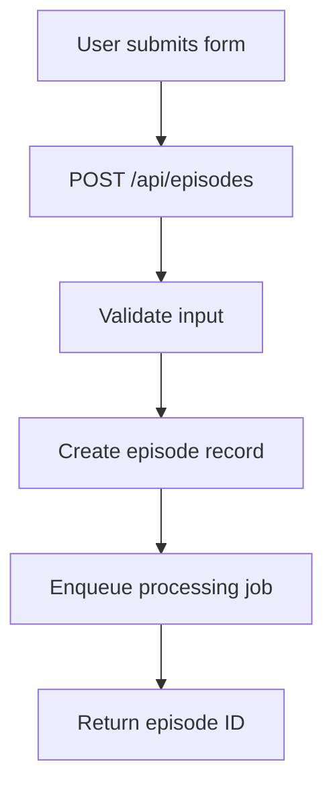
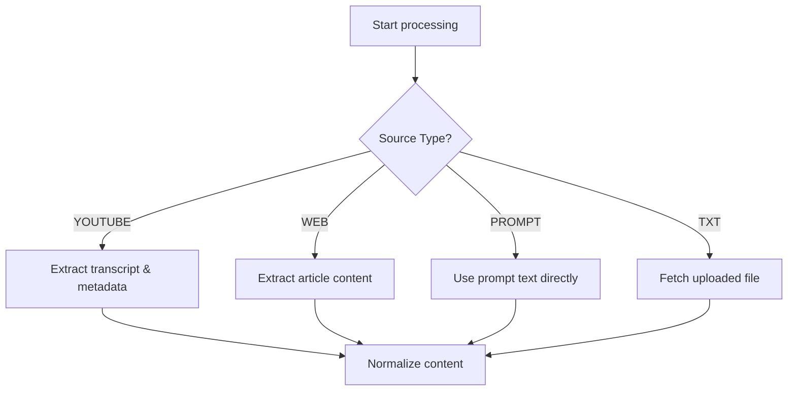
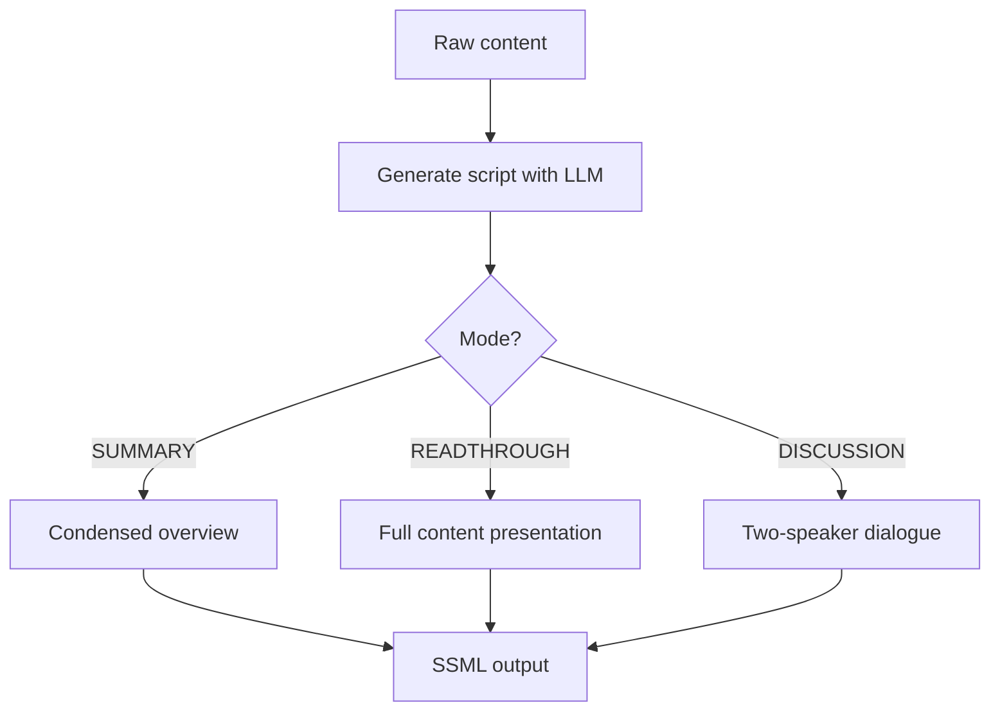
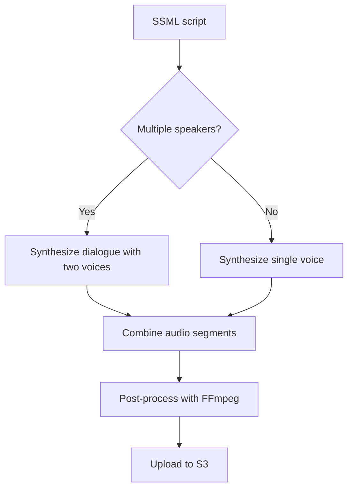
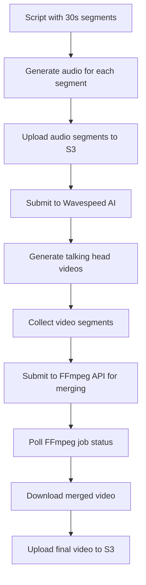

# Podcasty - Technical Architecture Documentation

## Overview

Podcasty is an AI-powered podcast generation platform that transforms text prompts, URLs, and uploaded content into professional podcast episodes with optional video generation. This document provides a comprehensive technical overview of the system architecture, AI models, API endpoints, and data flow.

## System Architecture

### Core Components

```
┌─────────────────┐    ┌─────────────────┐    ┌─────────────────┐
│   Next.js App   │    │  Background     │    │   PostgreSQL │
│   (Frontend)    │◄──►│   Worker        │◄──►│   Database      │
│   Vercel        │    │   (Render)      │    │   (Prisma)      │
└─────────────────┘    └─────────────────┘    └─────────────────┘
         │                       │                       │
         │                       │                       │
         ▼                       ▼                       ▼
┌─────────────────┐    ┌─────────────────┐    ┌─────────────────┐
│   S3 Storage    │    │   Redis Queue   │    │   External APIs │
│   (Audio/Video) │    │   (BullMQ)      │    │   (AI Services) │
└─────────────────┘    └─────────────────┘    └─────────────────┘
```

### Technology Stack

- **Frontend**: Next.js 14 with TypeScript, Tailwind CSS
- **Backend**: Next.js API Routes with Prisma ORM
- **Database**: PostgreSQL with Prisma
- **Queue System**: BullMQ with Redis (optional fallback to inline processing)
- **Storage**: S3-compatible storage (AWS S3, Cloudflare R2, etc.)
- **Authentication**: NextAuth.js with Google OAuth
- **Deployment**: Vercel (frontend) + Render (worker)

## AI Models & Services

### 1. Large Language Models (LLM)

**Primary**: OpenAI GPT-4o-mini
- **Purpose**: Script generation and content transformation
- **Fallback**: Anthropic Claude-3.5-Sonnet
- **Configuration**: Environment variables `OPENAI_API_KEY`, `ANTHROPIC_API_KEY`

**Script Generation Process**:
```typescript
// src/services/llm.ts
export async function generateScript(raw: string, opts: {
  mode: "SUMMARY" | "READTHROUGH" | "DISCUSSION";
  targetMinutes?: number;
  language: string;
  style: string;
  twoSpeakers?: boolean;
  speakerNameA?: string;
  speakerNameB?: string;
  generateVideo?: boolean;
})
```

**Output Format**:
```json
{
  "title": "Episode Title",
  "ssml": "<speak>...</speak>",
  "chapters": [{"title":"...","hint":"..."}],
  "show_notes": "Markdown content",
  "estimated_wpm": 150,
  "speaker_names": {"A": "NameA", "B": "NameB"},
  "turns": [{"speaker": "A", "text": "..."}],
  "parts30s": {"1":"...","2":"..."} // For video generation
}
```

### 2. Text-to-Speech (TTS)

**Service**: ElevenLabs API
- **Primary Model**: `eleven_multilingual_v2`
- **Fallback Model**: `eleven_turbo_v2` (for short content)
- **Configuration**: `ELEVENLABS_API_KEY`, `ELEVENLABS_VOICE_ID`

**TTS Features**:
- SSML (Speech Synthesis Markup Language) support
- Multi-speaker dialogue support
- Custom voice selection
- Audio format: MP3 at 44.1kHz/160kbps

### 3. Video Generation

**Service**: Wavespeed AI + FFmpeg API
- **Wavespeed API**: `https://api.wavespeed.ai/api/v3/wavespeed-ai/multitalk`
- **FFmpeg API**: `https://ffmpegapi.net/api/merge_videos`
- **Features**: Lip-sync technology with talking head generation + video merging
- **Configuration**: `WAVESPEED_KEY`, `FFMPEG_API_KEY`

**Video Generation Process**:
1. **Script Segmentation**: LLM generates 30-second text segments during script creation
2. **Individual Audio Generation**: Each text segment is converted to audio separately using TTS
3. **Audio Upload**: Each 30-second audio segment is uploaded to S3 storage
4. **Video Generation**: Submit each audio segment to Wavespeed AI for talking head video generation
5. **Video Collection**: Collect all completed video segments from Wavespeed AI
6. **Video Merging**: Submit video URLs to FFmpeg API for concatenation
7. **Final Video**: Download merged video from FFmpeg API and upload to S3 storage

**Script Segmentation Details**:
```typescript
// LLM generates 30-second text segments during script creation
const script = await generateScript(raw, {
  mode: "SUMMARY",
  targetMinutes: 3,
  generateVideo: true, // This triggers 30s segmentation
  // ... other options
});

// Script output includes parts30s field:
// {
//   "parts30s": {
//     "1": "First 30 seconds of content...",
//     "2": "Second 30 seconds of content...",
//     "3": "Third 30 seconds of content..."
//   }
// }
```

**FFmpeg Merging Details**:
```typescript
// Submit merge job to FFmpeg API
const ffmpegRequestBody = {
  video_urls: completedVideoUrls,
  async: true
};

const ffmpegResponse = await fetch("https://ffmpegapi.net/api/merge_videos", {
  method: "POST",
  headers: {
    "X-API-Key": "ffmpeg_KfTAf98EY9OCuriwBtLT34ZtWZLJtnXX",
    "Content-Type": "application/json"
  },
  body: JSON.stringify(ffmpegRequestBody)
});

// Poll for completion (up to 60 polls @ 10s intervals = ~10 minutes)
const ffmpegStatusResponse = await fetch(`https://ffmpegapi.net/api/job/${jobId}/status`, {
  headers: { "X-API-Key": "ffmpeg_KfTAf98EY9OCuriwBtLT34ZtWZLJtnXX" }
});
```

### 4. Content Ingestion Services

**YouTube Processing**:
- `youtube-transcript-api` for transcript extraction
- `ytdl-core` for metadata extraction
- Web scraping fallback for title/description

**Web Content Processing**:
- Mozilla Readability library for article extraction
- Cheerio for HTML parsing
- JSDOM for DOM manipulation

## API Endpoints

### Core Episode Management

#### `POST /api/episodes`
**Purpose**: Create new episode
**Request Body**:
```typescript
{
  sourceType: "YOUTUBE" | "WEB" | "PDF" | "TXT" | "PROMPT";
  sourceUrl?: string;
  uploadKey?: string;
  mode: "SUMMARY" | "READTHROUGH" | "DISCUSSION";
  language: string;
  style: string;
  voice?: string;
  speakers?: number;
  voices?: string[];
  promptText?: string;
  targetMinutes?: number;
  includeIntro: boolean;
  includeOutro: boolean;
  includeMusic: boolean;
  chaptersEnabled: boolean;
  speakerNames?: {A?: string, B?: string};
  isPublic: boolean;
  generateVideo: boolean;
  coverUrl?: string;
}
```

#### `GET /api/episodes`
**Purpose**: List user episodes with pagination

#### `GET /api/episodes/[id]`
**Purpose**: Get specific episode details

#### `GET /api/episodes/[id]/status`
**Purpose**: Get episode processing status

#### `GET /api/episodes/[id]/events`
**Purpose**: Get episode processing event logs

### Video Generation

#### `POST /api/episodes/[id]/retrieve-video`
**Purpose**: Trigger video generation for existing audio episode

### Content Ingestion

#### `POST /api/uploads`
**Purpose**: Upload files (images, text files)

#### `GET /api/proxy/[...key]`
**Purpose**: Serve uploaded files with authentication

### Public Access

#### `GET /api/public/episodes`
**Purpose**: List public episodes

#### `GET /api/public/episodes/[id]`
**Purpose**: Get public episode details

#### `GET /api/rss`
**Purpose**: Generate RSS feed for podcast

### Admin Endpoints

#### `GET /api/admin/stats`
**Purpose**: System statistics and usage metrics

#### `GET /api/admin/users`
**Purpose**: User management

#### `GET /api/admin/video-episodes`
**Purpose**: Video episode management

#### `GET /api/admin/plans`
**Purpose**: Plan configuration

#### `GET /api/admin/settings`
**Purpose**: Site settings management

### Authentication

#### `POST /api/auth/register`
**Purpose**: User registration

#### `POST /api/user/password`
**Purpose**: Password management

### External Services

#### `GET /api/voices`
**Purpose**: Get available TTS voices

#### `GET /api/health`
**Purpose**: Health check endpoint

## Database Schema

### Core Models

#### Episode Model
```prisma
model Episode {
  id              String        @id @default(cuid())
  userId          String
  sourceType      SourceType
  sourceUrl       String?
  uploadKey       String?
  mode            ModeType      @default(SUMMARY)
  language        String        @default("en")
  style           String        @default("conversational")
  voice           String        @default("default")
  speakers        Int           @default(1)
  voicesJson      Json?
  speakerNamesJson Json?
  targetMinutes   Int?
  includeIntro    Boolean       @default(true)
  includeOutro    Boolean       @default(true)
  includeMusic    Boolean       @default(false)
  chaptersEnabled Boolean       @default(true)
  promptText      String?
  status          EpisodeStatus @default(CREATED)
  title           String?
  showNotesMd     String?       @db.Text
  ssml            String?       @db.Text
  estimatedWpm    Int?
  chaptersJson    Json?
  audioUrl        String?
  audioBytes      BigInt?       @db.BigInt
  durationSec     Int?
  coverUrl        String?
  videoUrl        String?
  generateVideo   Boolean       @default(false)
  jobId           String?
  errorMessage    String?
  isPublic        Boolean       @default(true)
  createdAt       DateTime      @default(now())
  updatedAt       DateTime      @updatedAt
}
```

#### User Model
```prisma
model User {
  id        String   @id @default(cuid())
  name      String?
  email     String?  @unique
  password  String?
  emailVerified DateTime?
  image     String?
  plan      PlanType  @default(FREE)
  isAdmin   Boolean   @default(false)
  stripeCustomerId       String?
  stripeSubscriptionId   String?
  subscriptionStatus     String?
  subscriptionPeriodEnd  DateTime?
  createdAt DateTime @default(now())
  updatedAt DateTime @updatedAt
}
```

### Enums
```prisma
enum SourceType {
  YOUTUBE
  WEB
  PDF
  TXT
  PROMPT
}

enum ModeType {
  SUMMARY
  READTHROUGH
  DISCUSSION
}

enum EpisodeStatus {
  CREATED
  INGESTING
  SCRIPTING
  SYNTHESIZING
  AUDIO_POST
  VIDEO_RENDER
  PUBLISHED
  FAILED
}

enum PlanType {
  FREE
  BASIC
  PREMIUM
}
```

## Episode Processing Workflow

### 1. Episode Creation


### 2. Content Ingestion


### 3. Script Generation


### 4. Audio Synthesis


### 5. Video Generation (Optional)


## Environment Variables

### Required
```bash
# Database
DATABASE_URL=postgresql://...

# Authentication
NEXTAUTH_SECRET=your-secret-key
NEXTAUTH_URL=https://your-domain.vercel.app

# Storage
S3_BUCKET=your-bucket-name
S3_REGION=us-east-2
S3_ACCESS_KEY_ID=your-access-key
S3_SECRET_ACCESS_KEY=your-secret-key
S3_ENDPOINT= # Leave empty for AWS S3

# AI Services
OPENAI_API_KEY=sk-...
ELEVENLABS_API_KEY=...
WAVESPEED_KEY=...
FFMPEG_API_KEY=ffmpeg_...

# App Configuration
APP_URL=https://your-domain.vercel.app
```

### Optional
```bash
# Queue System
REDIS_URL=redis://...
UPSTASH_REDIS_URL=redis://...

# Fallback LLM
ANTHROPIC_API_KEY=sk-...

# Email
SMTP_HOST=smtp.gmail.com
SMTP_PORT=587
SMTP_USER=your-email@gmail.com
SMTP_PASS=your-password

# Stripe
STRIPE_SECRET_KEY=sk_...
STRIPE_WEBHOOK_SECRET=whsec_...

# OAuth
GOOGLE_CLIENT_ID=...
GOOGLE_CLIENT_SECRET=...
```

## Deployment Architecture

### Frontend (Vercel)
- Next.js application
- API routes for HTTP endpoints
- Static file serving
- Edge functions for performance

### Background Worker (Render)
- Node.js worker process
- BullMQ queue processing
- Long-running tasks
- File processing and AI API calls

### Database (PostgreSQL)
- Primary data storage
- Prisma ORM
- Connection pooling
- Backup and recovery

### Storage (S3-compatible)
- Audio file storage
- Video file storage
- Image uploads
- CDN integration

## Security Considerations

### Authentication
- NextAuth.js with Google OAuth
- Session management
- User role-based access control
- Admin-only endpoints

### Data Protection
- Input validation with Zod schemas
- SQL injection prevention via Prisma
- File upload restrictions
- Rate limiting on API endpoints

### API Security
- CORS configuration
- Request size limits
- Authentication middleware
- Error handling without sensitive data exposure

## Performance Optimizations

### Caching
- Redis for queue management
- S3 CDN for media delivery
- Database query optimization
- Static asset caching

### Scalability
- Horizontal scaling with worker processes
- Database connection pooling
- Queue-based processing
- S3-compatible storage scaling

### Monitoring
- Event logging for debugging
- Health check endpoints
- Error tracking and alerting
- Performance metrics

## Development Setup

### Prerequisites
- Node.js 18+
- PostgreSQL database
- Redis (optional, for queue)
- S3-compatible storage

### Installation
```bash
# Clone repository
git clone <repository-url>
cd podcasty

# Install dependencies
npm install

# Setup environment variables
cp .env.example .env.local
# Edit .env.local with your configuration

# Setup database
npx prisma migrate dev
npx prisma generate

# Start development server
npm run dev
```

### Database Management
```bash
# Create migration
npx prisma migrate dev --name migration-name

# Reset database
npx prisma migrate reset

# Generate Prisma client
npx prisma generate

# View database
npx prisma studio
```

## API Rate Limits & Quotas

### User Plans
- **FREE**: 3 episodes/month
- **BASIC**: 15 episodes/month  
- **PREMIUM**: 60 episodes/month

### External API Limits
- **OpenAI**: Based on API key limits
- **ElevenLabs**: Based on subscription tier
- **Wavespeed**: Based on API key limits
- **FFmpeg API**: Based on API key limits

### File Size Limits
- **Text prompts**: 35,000 characters max
- **Uploaded files**: 10MB max
- **Audio output**: 160kbps MP3
- **Video output**: Variable based on duration

## Error Handling

### Episode Processing Errors
- Graceful fallback to inline processing
- Detailed error logging
- User notification system
- Retry mechanisms for transient failures

### API Error Responses
```typescript
// Standard error format
{
  error: string;
  status: number;
  details?: any;
}
```

### Monitoring & Alerting
- Event log system
- Error tracking
- Performance metrics
- Health check endpoints

## Future Enhancements

### Planned Features
- Real-time processing status updates
- Advanced audio editing capabilities
- Custom voice training
- Multi-language support
- Advanced video customization
- Analytics and insights

### Technical Improvements
- Microservices architecture
- Event-driven processing
- Advanced caching strategies
- Machine learning optimizations
- Performance monitoring
- Automated testing

---

This technical documentation provides a comprehensive overview of the Podcasty system architecture, enabling developers to understand, maintain, and extend the platform effectively.
